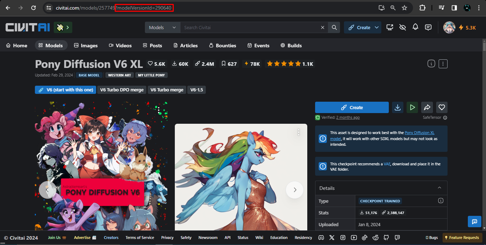
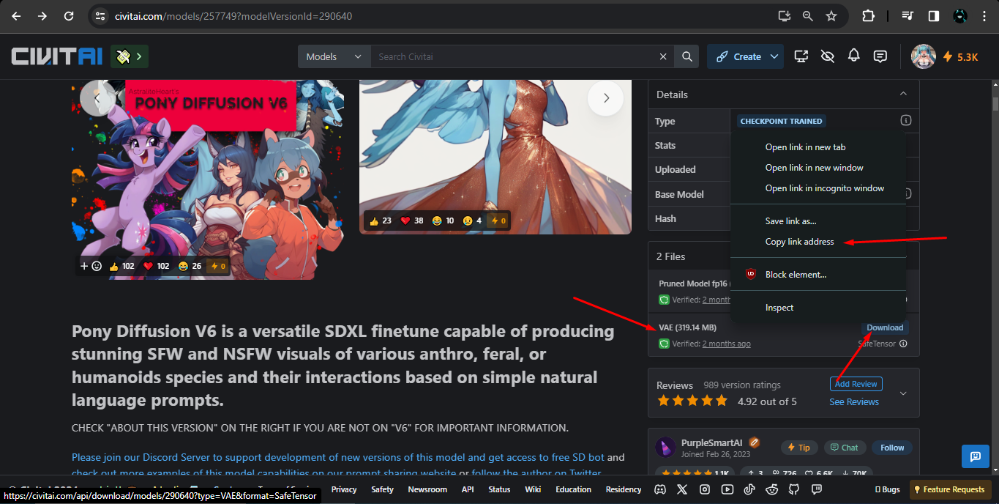
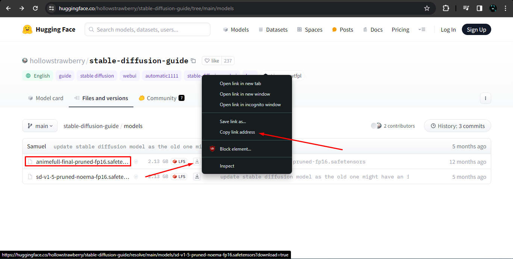

# Lora_Easy_Training_Colab

> A [colab](https://colab.research.google.com/github/Jelosus2/Lora_Easy_Training_Colab/blob/main/Lora_Easy_Training_Colab.ipynb) powered by [Lora_Easy_Training_Scripts_Backend](https://github.com/derrian-distro/LoRA_Easy_Training_scripts_Backend) created by [Derrian Distro](https://github.com/derrian-distro)

## Guide

You can check the [guide I made on CivitAI](https://civitai.com/articles/4409)

## Table of content

- [How to obtain the Ngrok token](#how-to-obtain-the-ngrok-token)
- [How to install the UI](#how-to-install-the-ui)
  - [Windows](#windows)
  - [Linux](#linux)
- [How to get the link for custom model/VAE](#how-to-get-the-link-for-custom-modelvae)
  - [Civitai](#from-civitai)
  - [HuggingFace](#from-huggingface)
- [Changelog](#changelog)

## How to obtain the Ngrok token

The colab uses `cloudflared` quick tunnels as the default method but if it goes down or there's any issue with it you can use the other method to create a tunnel which is ngrok. The only difference with cloudflared is that you will need a token to create the tunnel. You can get it in the [Ngrok's dashboard](https://dashboard.ngrok.com/), in the "Your AuthToken" tab.


## How to install the UI

### Windows

Prerequisites:
- Download and install [Git](https://git-scm.com/downloads)
- Download and install [Python 3.10.9](https://www.python.org/downloads/release/python-3109/#:~:text=Full%20Changelog-,Files,-Version) or [Python 3.11](https://www.python.org/downloads/release/python-3110/#:~:text=Full%20Changelog-,Files,-Version)

Open a command line or PowerShell and run this commands in order
```
git clone -b dev https://github.com/derrian-distro/LoRA_Easy_Training_Scripts
cd LoRA_Easy_Training_Scripts
install.bat
```
New: When you run `install.bat` answer the question "Are you using this locally?" with **n**.<br>
Old: When you run `install.bat` answer the question "Are you using colab?" with **y**.

To run the UI use the `run.bat`

### Linux

Prerequisites:
- Install Git with `sudo apt install git`
- Install Python 3.10 venv (`sudo apt install python3.10-venv`) or Python 3.11 venv (`sudo apt install python3.11-venv`)

Open a terminal and run the following commands in order
```
git clone -b dev https://github.com/derrian-distro/LoRA_Easy_Training_Scripts
cd LoRA_Easy_Training_Scripts

# Python 3.10
python3.10 ./install.py

# Python 3.11
python3.11 ./install.py
```

New: When you run the installer answer the question "Are you using this locally?" with **n**.<br>
New: When you run the installer answer the question "Are you using colab?" with **y**.

To run the UI first you have to give permissions to the `run.sh` file, here is an example:
```
sudo chmod 755 ./run.sh
```
and then you can run the UI with
```
./run.sh
```

## How to get the link for custom model/VAE

### From Civitai

#### Method 1

This method works for models/VAEs with 2 or more versions and if the version has only 1 file attached to it. Go to the page of the model/VAE you want to obtain the URL, if you see `?modelVersionId=XXXXXX` you can just copy it and paste it in the colab. If you don't then switch to another version and then switch back to the version you want to download.



#### Method 2

If the model/VAE only has only one version or the same version has 2+ files attached to it and what you can do is going to the page of the model/VAE, scroll down and display the files, right click on the "Download" button and copy the link address.



### From HuggingFace

#### Mehod 1

Go inside the model/VAE you want to download and copy the URL.


#### Method 2

Go to the directory where the model/VAE is located, right click on the download icon and copy the link address.



## Changelog
- December 9th, 2025:
  - Added support to specify branch to download.
- December 8th, 2025:
  - Added support for Machina's fork and my fork.
- February 3rd, 2025:
  - Fixed slow tagging.
  - Fixed path issues when setting up directories.
- November 16th, 2024:
  - Added emojis to make sections separation easy to the eyes.
  - Added Illustrious v0.1 and NoobAI 1.0 (Epsilon) to the list of default checkpoints available to download.
- August 7, 2024:
  - Removed support for Forked trainer version as it's likely that won't get any update. 
- July 29, 2024:
  - Added the new [wd-vit-large-tagger-v3](https://huggingface.co/SmilingWolf/wd-vit-large-tagger-v3) and [wd-eva02-large-tagger-v3](https://huggingface.co/SmilingWolf/wd-eva02-large-tagger-v3) taggers.
- June 30, 2024:
  - Fixed wd taggers and BLIP captioning + now all taggers run on onnx run time. Keras run time has been removed since it's actually much slower.
  - Now you can use paths to specify where you want to setup the LoRA folder instead of just a name on the root of drive/google colab.
  - Added the ability to give different file names for downloaded models and VAEs. Additionally, now you can save them on your own google drive.
  - Fixed a bunch of bugs and errors.
- April 9, 2024:
  - Fixed the tagging cell for v2 taggers.
  - Added more options to the tagging cell.
  - Added a LoRA resizer cell under the Utils section.
  - Reworked some of the code and stopped using `os` library for path and file managemenet. Using `pathlib` instead.
- April 4, 2024:
  - Simplify the fix for the sd scripts logging issue.
  - Improved the dependency installation for the captioning cell (Ignore tensorboard error).
- April 2, 2024:
  - Updated Animagine from 3.0 to 3.1 in the default models available to download.
- March 29, 2024:
  - Fixed the trainer. You have to update the UI (both original or forked).
  - Added a field that allows you to input a token either from HuggingFace or Civitai to download gated models/VAEs and private datasets.
- March 10, 2024:
  - Modified the way Forked trainer is installed due to CAME and REX being officially implemented. You have to update the UI (both original or forked) if you want to use any of those, just open a command line in the root folder of the UI and run `git pull`
  - Added the newly released v3 taggers and modified the script to make them work.