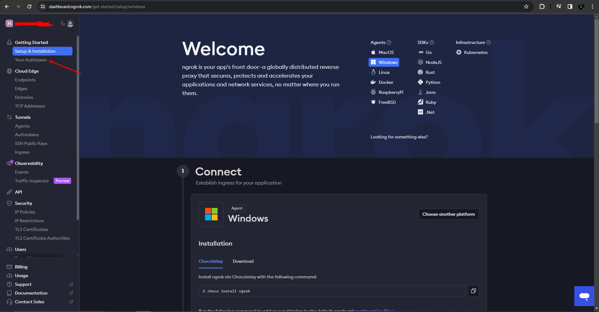
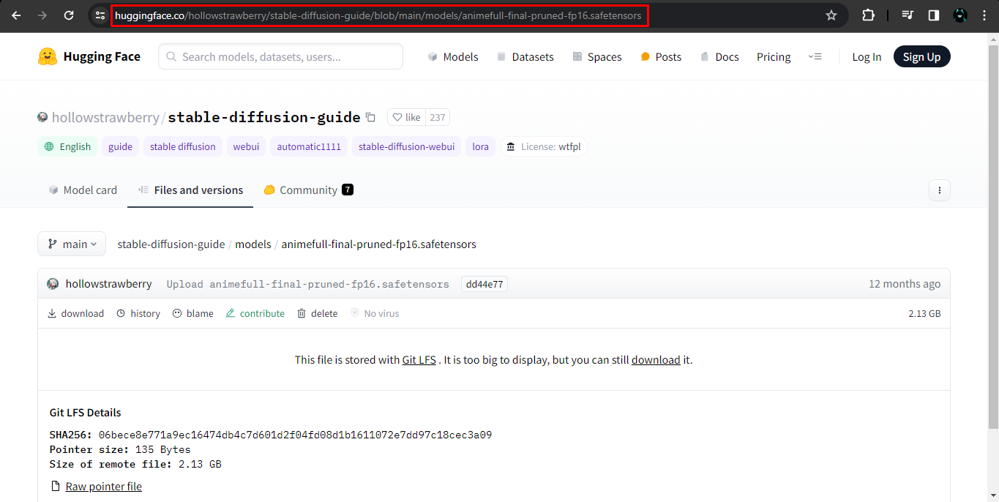

# Lora_Easy_Training_Colab

A colab powered by [Lora_Easy_Training_Scripts_Backend](https://github.com/derrian-distro/LoRA_Easy_Training_scripts_Backend) created by [Derrian Distro](https://github.com/derrian-distro)

### DISCLAIMER: The Forked version of the trainer is not maintained by Derrian, please do not open issues there if you encounter any problem. Instead submit them in the [forked repo](https://github.com/Jelosus2/LoRA_Easy_Training_scripts_Backend/).

## Guide

You can check the [guide I made on CivitAI]() (TODO: Add link once redacted)

## Table of content

- [Additions of the Forked version](#additions-of-the-forked-version)
- [How to obtain the Ngrok token](#how-to-obtain-the-ngrok-token)
- [How to install the UI](#how-to-install-the-ui)
  - [Windows](#windows)
  - [Linux](#linux)
- [How to get the link for custom model/VAE](#how-to-get-the-link-for-custom-modelvae)
  - [Civitai](#from-civitai)
  - [HuggingFace](#from-huggingface)

## Additions of the Forked version

The forked trainer is a modified unofficial version that adds additional features.

The list of addition features:
- Optimizers:
  - CAME
- Schedulers:
  - REX 

## How to obtain the Ngrok token

The colab uses `cloudflared` quick tunnels as the default method but if it goes down you can use the other method to create a tunnel which is ngrok. The only difference with cloudflared is that you will need a token to create the tunnel. You can get it in the [Ngrok's dashboard](https://dashboard.ngrok.com/), in the "Your AuthToken" tab.



## How to install the UI

### Windows

Prerequisites:
- Download and install [Git](https://git-scm.com/downloads)
- Download and install [Python 3.10.9](https://www.python.org/downloads/release/python-3109/#:~:text=Full%20Changelog-,Files,-Version) or [Python 3.11](https://www.python.org/downloads/release/python-3110/#:~:text=Full%20Changelog-,Files,-Version)

#### Original

Open a command line or PowerShell and run this commands in order
```
git clone -b dev https://github.com/derrian-distro/LoRA_Easy_Training_Scripts
cd LoRA_Easy_Training_Scripts
install.bat
```
When you run `install.bat` answer the question "Are you using this locally?" with **n**

To run the UI use the `run.bat`

#### Forked

Open a command line or PowerShell and run this commands in order
```
git clone https://github.com/Jelosus2/LoRA_Easy_Training_Colab_Frontend
cd LoRA_Easy_Training_Colab_Frontend
install.bat
```

To run the UI use the `run.bat`

### Linux

Prerequisites:
- Install Git with `sudo apt install git`
- Install Python 3.10 venv (`sudo apt install python3.10-venv`) or Python 3.11 venv (`sudo apt install python3.11-venv`)

#### Original

Open a terminal and run the following commands in order
```
git clone -b dev https://github.com/derrian-distro/LoRA_Easy_Training_Scripts
cd LoRA_Easy_Training_Scripts

# Python 3.10
python3.10 ./install.py

# Python 3.11
python3.11 ./install.py
```

When you run the installer answer the question "Are you using this locally?" with **n**

To run the UI first you have to give permissions to the `run.sh` file, here is an example:
```
sudo chmod 755 ./run.sh
```
and then you can run the UI with
```
./run.sh
```

#### Forked

Open a terminal and run the following commands in order
```
git clone https://github.com/Jelosus2/LoRA_Easy_Training_Colab_Frontend
cd LoRA_Easy_Training_Colab_Frontend

# Python 3.10
python3.10 ./install.py

# Python 3.11
python3.11 ./install.py
```

To run the UI first you have to give permissions to the `run.sh` file, here is an example:
```
sudo chmod 755 ./run.sh
```
and then you can run the UI with
```
./run.sh
```

## How to get the link for custom model/VAE

### From Civitai

#### Method 1

This method works for models/VAEs with 2 or more versions and if the version has only 1 file attached to it. Go to the page of the model/VAE you want to obtain the URL, if you see `?modelVersionId=XXXXXX` you can just copy it and paste it in the colab. If you don't then switch to another version and then switch back to the version you want to download.


#### Method 2

If the model/VAE only has only one version or the same version has 2+ files attached to it and what you can do is going to the page of the model/VAE, scroll down and display the files, right click on the "Download" button and copy the link address.


### From HuggingFace

#### Mehod 1

Go inside the model/VAE you want to download and copy the URL.



#### Method 2

Go to the directory where the model/VAE is located, right click on the download icon and copy the link address.

